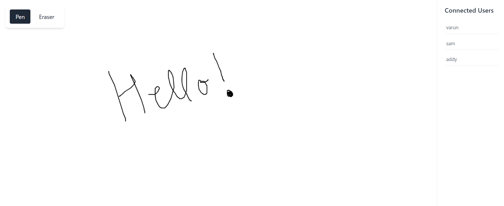

# Real-Time Collaborative Drawing App

A real-time collaborative drawing application built with React, Node.js, and Socket.IO. Users can join a shared canvas, draw together in real-time, and see who else is currently connected.



## Features

- Real-time collaborative drawing
- Synchronized canvas state across all users
- Live User presence
- Drawing tools (Pen and Eraser)
- Responsive design

## Tech Stack

- **Frontend:**
  - React (Vite)
  - Tailwind CSS
  - Socket.IO Client

- **Backend:**
  - Node.js
  - Express
  - Socket.IO

## Prerequisites

Before you begin, ensure you have installed:
- Node.js
- npm

## Installation

1. Clone the repository:
```bash
git clone https://github.com/varun77x/CollabDraw.git
cd CollabDraw
```

2. Install frontend dependencies:
```bash
cd frontend
npm install
```

3. Install backend dependencies:
```bash
cd backend
npm install
```

## Configuration

1. Create a `.env` file in the `backend` directory:
```env
PORT=5000
```

2. Update the Socket.IO connection URL in `frontend/src/App.jsx` if needed:
```javascript
socketRef.current = io('http://localhost:5000');
```

## Running the Application

1. Start the backend server:
```bash
cd backend
nodemon server.js
```

2. In a new terminal, start the frontend development server:
```bash
cd frontend
npm run dev
```
Give a ⭐️ if this project helped you!